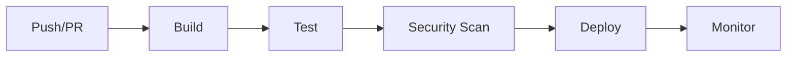

# CI/CD Guide

## Overview

This guide covers the CI/CD pipeline implementation for HEP Companion, including build, test, security scanning, and deployment processes.

## Pipeline Architecture



## GitHub Actions Workflows

### 1. Docker Build (`docker-build.yml`)
- Triggers on push to main and pull requests
- Builds multi-platform Docker images
- Implements layer caching
- Pushes to GitHub Container Registry

### 2. Docker Test (`docker-test.yml`)
- Runs unit and integration tests
- Generates coverage reports
- Uploads test artifacts
- Reports to Codecov

### 3. Security Scan (`security-scan.yml`)
- Weekly vulnerability scanning
- Container scanning with Trivy
- SAST scanning with CodeQL
- Reports security issues

## Docker Registry

### GitHub Container Registry
- Images are pushed to `ghcr.io/hep-companion`
- Tags follow semantic versioning
- Supports multi-platform builds

### Image Tags
- `latest`: Latest stable build
- `v1.2.3`: Version tags
- `sha-abc123`: Commit-specific builds
- `pr-123`: Pull request builds

## Deployment

### Production Deployment
1. Build and push Docker image
2. Update deployment configuration
3. Apply Kubernetes manifests
4. Verify health checks
5. Monitor deployment

### Rollback Procedure
1. Identify previous stable version
2. Update deployment to previous version
3. Verify application health
4. Document rollback reason

## Security

### Vulnerability Scanning
- Weekly automated scans
- Critical/high severity blocking
- False positive management
- Remediation tracking

### Secret Management
- Kubernetes secrets for sensitive data
- GitHub secrets for CI/CD
- Environment-specific configurations
- Regular secret rotation

## Monitoring

### Health Checks
- Application readiness probe
- Liveness probe
- Resource monitoring
- Log aggregation

### Alerts
- Deployment failures
- Health check failures
- Resource constraints
- Security incidents

## Best Practices

### Development
1. Always run tests locally before pushing
2. Keep Docker images up to date
3. Follow semantic versioning
4. Document breaking changes

### Deployment
1. Use blue-green deployment
2. Implement proper health checks
3. Monitor resource usage
4. Keep deployment logs

### Security
1. Regular security updates
2. Scan dependencies
3. Review access controls
4. Audit logging

## Troubleshooting

### Common Issues

#### Build Failures
```bash
# Check build logs
npm run docker:build -- --progress=plain

# Clean build cache
docker builder prune
```

#### Test Failures
```bash
# Run specific test suite
npm run docker:test:unit
npm run docker:test:integration

# Debug test container
docker-compose -f docker-compose.test.yml run --rm jest bash
```

#### Deployment Issues
```bash
# Check deployment status
npm run docker:ps:prod

# View deployment logs
npm run docker:logs:prod

# Rollback deployment
npm run docker:deploy:rollback
```

### Support

For CI/CD issues:
1. Check GitHub Actions logs
2. Review deployment history
3. Consult security scan reports
4. Contact DevOps team

## Future Improvements

1. Implement canary deployments
2. Add performance testing
3. Enhance security scanning
4. Improve monitoring
5. Add deployment metrics 