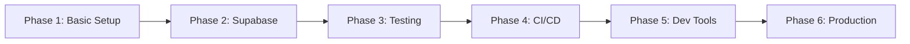

# Docker Implementation Quick Reference

## Phase Overview

### 🚀 Phase 1: Basic Containerization
**Goal**: Get Next.js running in Docker
- **Time**: 2-3 hours
- **Deliverables**: Dockerfile, docker-compose.yml, .dockerignore
- **Key Feature**: Hot-reload development environment

### 🗄️ Phase 2: Supabase Integration  
**Goal**: Local Supabase stack
- **Time**: 3-4 hours
- **Deliverables**: PostgreSQL, Auth, Storage services
- **Key Feature**: Fully isolated database environment

### 🧪 Phase 3: Testing Infrastructure
**Goal**: Containerized testing
- **Time**: 3-4 hours  
- **Deliverables**: Jest & Playwright containers
- **Key Feature**: Parallel, isolated test execution

### 🔄 Phase 4: CI/CD Integration
**Goal**: Automated pipelines
- **Time**: 2-3 hours
- **Deliverables**: GitHub Actions, image registry
- **Key Feature**: Automated build and deploy

### ⚡ Phase 5: Developer Experience
**Goal**: Optimized workflow
- **Time**: 2-3 hours
- **Deliverables**: Tools, monitoring, shortcuts
- **Key Feature**: 5-minute onboarding

### Phase 6: Production Ready
**Goal**: Enterprise deployment
- **Time**: 3-4 hours
- **Deliverables**: Security, scaling, compliance
- **Key Feature**: HIPAA-compliant infrastructure

## Execution Order



## Quick Commands After Implementation

```bash
# Development
docker-compose up -d          # Start all services
docker-compose logs -f app    # View app logs
docker-compose down          # Stop all services

# Testing
npm run docker:test:all      # Run all tests
npm run docker:test:watch    # Watch mode

# Database
npm run docker:db:migrate    # Run migrations
npm run docker:db:reset      # Reset database

# Production
npm run docker:build         # Build prod image
npm run docker:deploy        # Deploy to prod
```

## File Structure After All Phases

```
HEP-companion/
├── Dockerfile                 # Multi-stage build
├── docker-compose.yml         # Development services
├── docker-compose.override.yml # Local overrides
├── docker-compose.test.yml    # Test environment
├── docker-compose.prod.yml    # Production config
├── .dockerignore             # Build exclusions
├── .env.docker               # Docker env vars
├── docker/
│   ├── entrypoint.sh         # App entrypoint
│   ├── healthcheck.js        # Health checks
│   └── init-db/              # DB initialization
├── k8s/                      # Kubernetes configs
└── Makefile                  # Developer shortcuts
```

## Key Benefits by Phase

| Phase | Primary Benefit | Secondary Benefits |
|-------|----------------|-------------------|
| 1 | Consistent dev environment | Easy onboarding |
| 2 | Local database isolation | No cloud costs for dev |
| 3 | Reliable test execution | Parallel testing |
| 4 | Automated deployments | Version control |
| 5 | Developer productivity | Better debugging |
| 6 | Production stability | Compliance ready |

## Common Issues & Solutions

### Phase 1 Issues
- **Port conflicts**: Change ports in docker-compose.yml
- **Slow builds**: Implement BuildKit caching

### Phase 2 Issues  
- **Database connection**: Check Docker network settings
- **Migration failures**: Verify migration order

### Phase 3 Issues
- **Test timeouts**: Increase timeout values
- **Browser issues**: Use specific browser versions

### Phase 4-6 Issues
- **Registry auth**: Configure Docker credentials
- **Resource limits**: Adjust container resources
- **Permissions**: Use proper user IDs

## Success Metrics

**Phase 1**: App runs at localhost:3000  
**Phase 2**: Database operations work  
**Phase 3**: All tests pass in Docker  
**Phase 4**: Automated builds succeed  
**Phase 5**: 5-minute setup time  
**Phase 6**: Production deployment ready